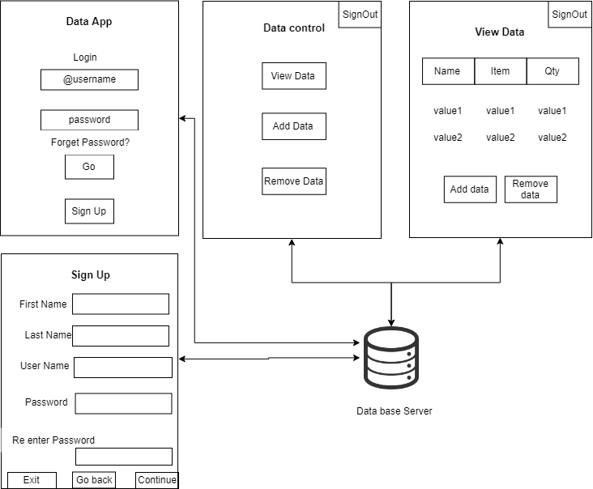

# Ionic Demo Registration App
A Test app to represent data. 

Getting Started: Check these dependencies installed globally in your machine :)
Since task are not yet divided. As Pubudu mentioned we should quickly divide the task. 

`npm install -g cordova`

`npm install -g ionic`

To get started with the project:
    git clone repo or fork to your account 
    `cd test_app`
    `npm install`
    `ionic serve` on browser 
    for ios `ionic cordova emulate ios`
    for android `ionic cordova emulate android` 
    and then for real devices `cordova run android`

for initial testing on deivces tested it on my android device. It workded. for iOS i didn't have a device. 

Contribution:
Create your branch:
    `git checkout -b your-awesome-branch`
lets make the changes to the project and make an awesome test_app :)

PRs can be finalized after testing the each features from everyone. 

Lets divided according to Kusal's Wireframe Design

